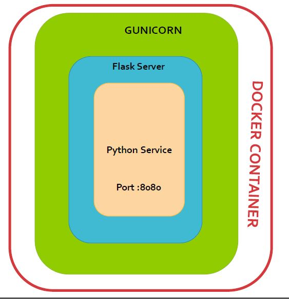

# Performance Result Filter Microservice

### Introduction

This microservice is used to filter performance response and requests and reads the data from performance microservice.
When used in the Swiftops it requires root-service on top of it which passes the query as an input to this service. 
This can also be used as an template to create new microservices. To create new microservice just create a similar service and register the same in the mongo db by using registartion-service.

service apis :

* performance_report_filter

##### What does performance_report_filter micro-service do?
If release is given in the input then compare the given release with the default release configured in mongo db else compare with the latest release performance report with its previous release and pass the same release to the base microservice which returns the performace reports url. This url is the output of this filter service.

### Pre-Requisite

1. python 3.6.0 or above version.
2. docker Refer [Install Docker](https://www.digitalocean.com/community/tutorials/how-to-install-and-use-docker-on-ubuntu-16-04) documentation.
3. [mongo-db] (https://www.mongodb.com/)

## Installation
### Checkout Repository
```
$git clone https://github.com/swiftops/performance-result-filter-service.git
```

##### Configuration

Steps :
1. Open system.properties edit consul ip
2. Open config.ini and edit `<auth_token>` and `<user_id>`.

### 1. Deploy inside Docker
    
##### Steps to start microservice
Once done with the pre-requisite exceute below command to start  perfservice microservice
```
docker build -t <image-name>
docker run -p 5005:5005 -v 8086:8086 --name ms-perfservice -d <image-name>
```

### How to use
In order to call above microservices. we just need to hit below URL  from the browser
```
http://<MACHINE-IP>/perfservice/performance_report_filter
```
### 2. On Commit Auto-deploy on specific server.
---
To autodeploy your docker container based service on server used below steps
* You need to configure Gitlab Runner to execute Gitlab CI/CD Pipeline. See [Gitlab Config](https://docs.gitlab.com/runner/install)

As soon as you configure runner auto deployment will start as you commited the code in repository.
refer .gitlab-ci.yml file.

### 3. Deploy on local environment.
----
##### Pre-Requisite
* Open system.properties edit consul ip
 
#### 3. Create Virtual Environment
Virtualenv is the easiest and recommended way to configure a custom Python environment for your services.
To install virtualenv execute below command:
```sh
$pip3 install virtualenv
```
You can check version for virtual environment version by typing below command:
```sh
$virtualenv --version
```
Create a virtual environment for a project:
```
$ cd <my_project_folder>
$ virtualenv virtenv
```
virtualenv `virtenv` will create a folder in the current directory which will contain the Python executable files, and a copy of the pip library which you can use to install other packages. The name of the virtual environment (in this case, it was `virtenv`) can be anything; omitting the name will place the files in the current directory instead.

This creates a copy of Python in whichever directory you ran the command in, placing it in a folder named `virtenv`.

You can also use the Python interpreter of your choice (like python3.6).
```
$virtualenv -p /usr/bin/python3.6 virtenv
```
To begin using the virtual environment, it needs to be activated:
```
$ source virtenv/bin/activate
```
The name of the current virtual environment will now appear on the left of the prompt (e.g. (virtenv)Your-Computer:your_project UserName$) to let you know that it’s active. From now on, any package that you install using pip will be placed in the virtenv folder, isolated from the global Python installation. You can add python packages needed in your microservice decelopment within virtualenv. 

#### Install python module dependanceies
```
pip install -r requirements.txt
```
#### To start microservice 
```
python services.py
```


#### To access Microservice
```
e.g http://<MACHINE-IP>/perfservice/performance_report_filter
```
### Architechture


##### Flask
Flask is a micro web framework written in Python. It is classified as a microframework because it does not require particular tools or libraries.It has no database abstraction layer, form validation, or any other components where pre-existing third-party libraries provide common functions. However, Flask supports extensions that can add application features as if they were implemented in Flask itself.
http://flask.pocoo.org/docs/1.0/quickstart/


##### Gunicorn
The Gunicorn "Green Unicorn" (pronounced gee-unicorn)[2] is a Python Web Server Gateway Interface (WSGI) HTTP server. 

###### Features
* Natively supports [WSGI] (https://wsgi.readthedocs.io/en/latest/what.html) , [web2py] (http://www.web2py.com/) and [Django] (https://www.djangoproject.com/).
* Automatic worker process management
* Simple Python configuration
* Multiple worker configurations
* Various server hooks for extensibility
* Compatible with Python 2.6+ and Python 3.2+[4]
http://docs.gunicorn.org/en/stable/configure.html

